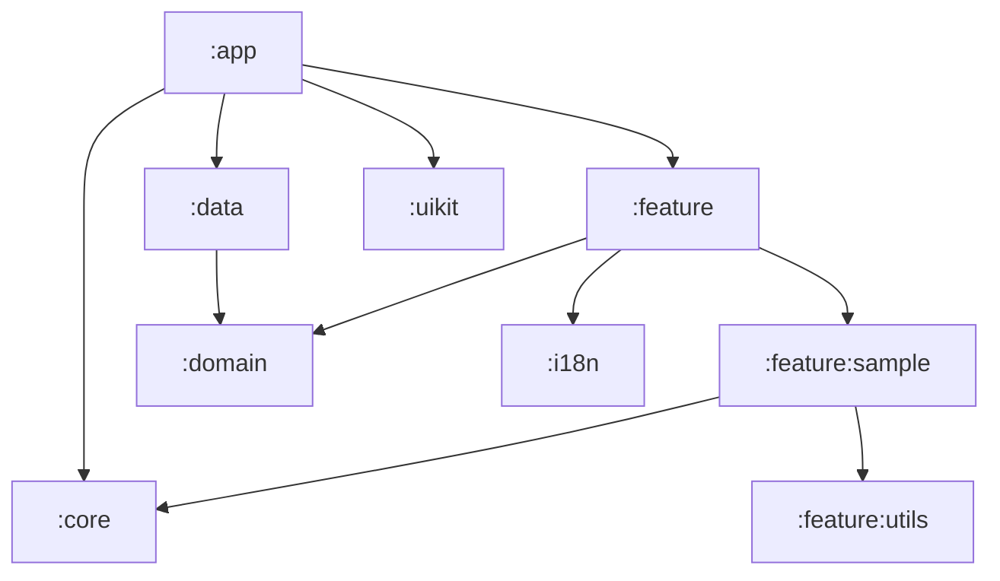

# Context

This document provides a detailed overview of the architectural decisions made
during the development of [the suppa](../). It serves as a follow-up explaining the
underlying principles and structure I adopted.

## Modules

| Module                           | Purpose & description                                        |
|----------------------------------|--------------------------------------------------------------|
| [`:app`](../app)                 | Primary entry point and dependency injection root.           |
| [`:build-logic`](../build-logic) | Houses convention plugins.                                   |
| [`:i18n`](../i18n)               | Manages all internationalization resources.                  |
| [`:feature`](../feature)         | Parent container for feature-specific business logic and UI. |
| [`:core`](../core)               | Cross-cutting utilities and shared infrastructure.           |
| [`:domain`](../domain)           | Framework-agnostic business models and use cases.            |
| [`:data`](../data)               | Data source implementations.                                 |
| [`:uikit`](../uikit)             | Reusable design system components and styling.               |

### The dependencies graph

```mermaid
graph TD;
    :app-->:feature
    :app-->:data
    :app-->:core
    :feature:sample-->:core
    :app-->:uikit
    :data-->:domain
    :feature-->:feature:sample
    :feature-->:domain
    :feature-->:i18n
    :feature:sample-->:feature:utils
```

#### Activities and fragments

You should create these components inheriting from the `ParamsActivity`,
`NoParamsActivity`, `ParamsFragment`, or `NoParamsFragment`.
They provide a convenient way to get featured view-models.