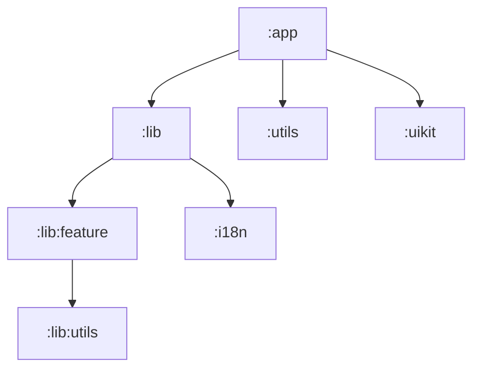

# Context

This document provides a detailed overview of the architectural decisions made 
during the development of [the suppa](../). It serves as a follow-up explaining the
underlying principles and structure I adopted.

## Modules

| Module                           | Purpose & description                             |
|----------------------------------|---------------------------------------------------|
| [`:app`](../app)                 | The main application entry point.                 |
| [`:build-logic`](../build-logic) | Houses convention plugins.                        |
| [`:i18n`](../i18n)               | Manages all internationalization resources.       |
| [`:lib`](../lib)                 | The parent directory for all core business logic. |
| [`:lib:feature`](../lib/feature) | Contains independent feature modules.             |
| [`:uikit`](../uikit)             | Contains the design system and UI/UX components.  |

### The dependencies graph



### About the lib module

This module is designed around principles of decoupling, modularity, and
build performance optimization, aligning closely with patterns common in
large, scalable projects.

#### Decoupling and modularity

In a large project codebase, dependencies often create bottlenecks. A
common anti-pattern is relying heavily on a single, **shared module** (like
a KYC repository). While initially convenient, this monolithic dependency
structure has a significant drawback: any small change to that central
module forces the recompilation of every dependent feature module, leading
to poor build performance.

To address this, I champion a highly decoupled architecture: **features
should be as independent as possible**. A feature module should define only
its own requirements and know nothing about external implementations.

#### The inversion of control strategy

1. Instead of features depending on concrete implementations in a shared
   library, each feature module **defines its own minimal interfaces or
   contracts** that it requires to function.
2. The shared lib module then implements these feature-specific interfaces.

This approach ensures that a feature module only relies on its own
contracts, not on external concrete classes. A change in a shared
implementation no longer forces the recompilation of every single feature
module.

#### Example: sample feature

Observe the [`build.gradle.kts`](../lib/feature/sample/build.gradle.kts) of a sample 
feature module below:

```kotlin
plugins {
    alias(libs.plugins.dev.kenkoro.feature)
}

dependencies {
    implementation(projects.lib.utils)

    implementation(libs.moko.errors)
}
```

Notice, there are only the `:utils` module and the convention plugin!

**P.S.:** This approach is great if you're planning to switch to the KMP, because
the Kotlin/Native framework doesn't currently support incremental builds.